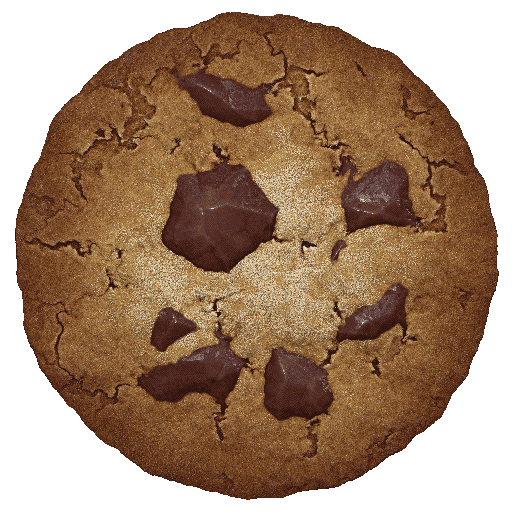

# Cookie Clicker (with fixes)

The original game can be found at http://orteil.dashnet.org/cookieclicker/

This mirror for, errrr, like, important educational purposes, either for download [here](https://github.com/plasma4/cookieclicker/archive/refs/heads/gh-pages.zip) for your own so-called "offline education" or to be played online from http://plasma4.github.io/cookieclicker/ if you cannot "teach" yourself about how to use the original URL. It also provides various fixes and works without internet when properly downloaded.

## What does this mod fix?
- Allows you to easily change or manage mods that you want to add
- Fixes import corruption
- Adds a method to stop the context menu from appearing when you right click
- Pixelates upgrade and achievement icons properly
- Allows the user to use the Pantheon and ascension menu properly on mobile